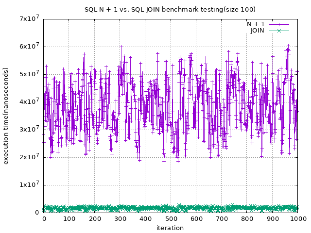
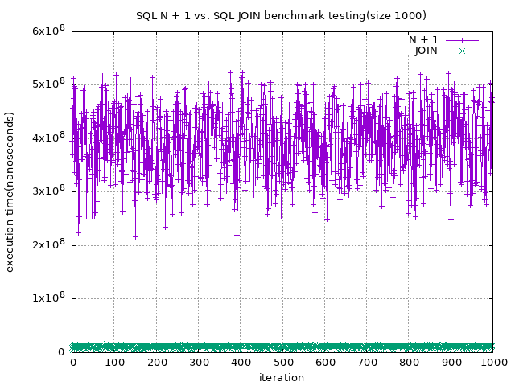
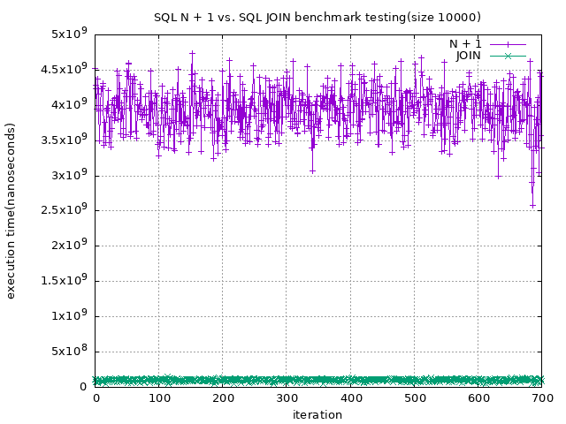

# SQL N + 1 vs. SQL JOIN Benchmark
This repository contains benchmark testing code of SQL N + 1 and SQL JOIN

## Benchmark Result




## Environment
```shell
$ uname -a
Linux station 5.16.0-051600-generic #202201092355 SMP PREEMPT Mon Jan 10 00:21:11 UTC 2022 x86_64 x86_64 x86_64 GNU/Linux

$ go version
go version go1.19.3 linux/amd64

$ mysql --version
mysql  Ver 8.0.31 for Linux on x86_64 (MySQL Community Server - GPL)
```

## How to do a Benchmark Test
```shell
// initialize database
$ make
// run api server
$ make server

// initialize database data
$ curl -vvv -d '{"size":1000}' -H "Content-Type: application/json" -X POST http://localhost:8080/init

// benchmark with round
$ $ curl -vvv -d '{"size":1000}' -H "Content-Type: application/json" -X POST http://localhost:8080/benchmark
```

## Plot
```shell
$ make plot
```

## License
This project is licensed under MIT License - see the [LICENSE](./LICENSE) file for more detail